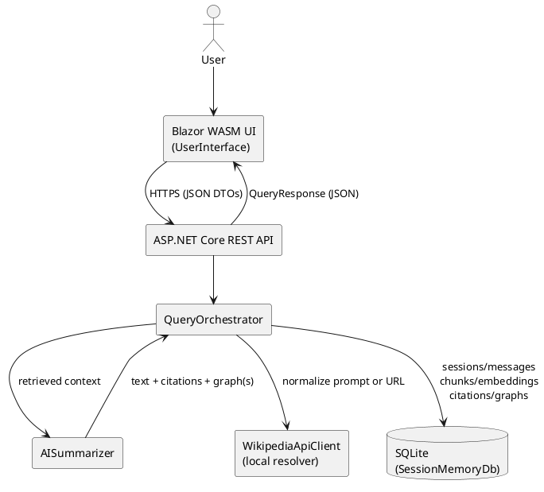
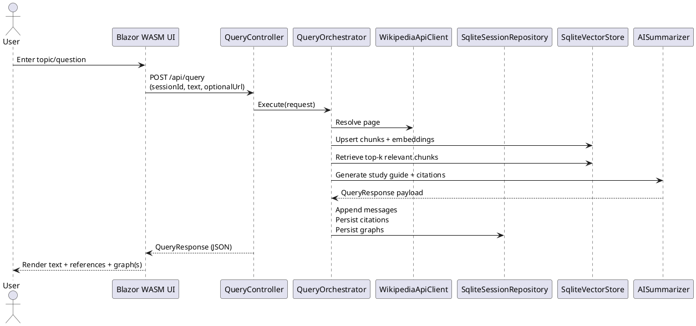
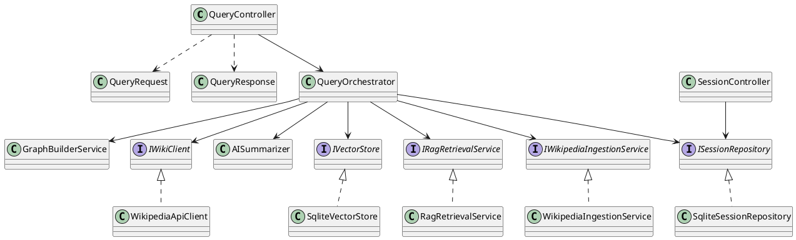
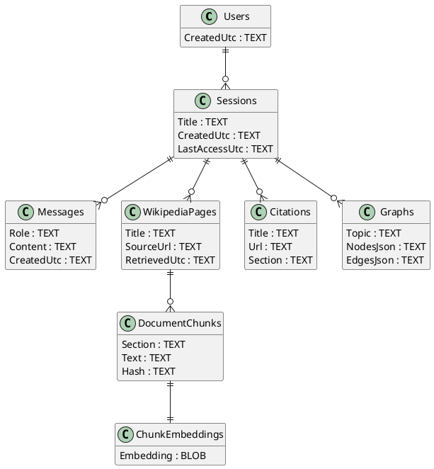

# Implementation Outline — Wikipedia RAG Chat, Study Guide, and Topic Graphs

For build, run, API, UI hosting, and test instructions, see [USAGE.md](./USAGE.md).

## 1) Goal and scope

This project reduces time spent researching by accepting a Wikipedia topic or article link and using an LLM to summarize and organize Wikipedia-based information into outputs that support early-stage project and paper development. The system prioritizes fast scope expansion and reference gathering rather than replacing deeper investigation. :contentReference[oaicite:0]{index=0}

## 2) System architecture overview

The system is implemented as a web application with a strict separation between the browser UI and server-side services. The client is a Blazor WebAssembly `UserInterface` composed of Razor components that render content and capture input, while retrieval, summarization, graph building, and persistence run behind an ASP.NET Core REST API. The UI communicates with the API over HTTP/JSON using shared DTO contracts so the client only depends on stable request/response models rather than internal entities. The API is now organized into controllers, application services, and infrastructure boundaries: `QueryController` and `SessionController` sit at the edge; `QueryOrchestrator` coordinates the RAG-style workflow; `WikipediaApiClient`, `SqliteSessionRepository`, and `SqliteVectorStore` live behind interfaces for future external integrations. The current implementation stays local-first and deterministic: it prepares Wikipedia-shaped content, citations, and graph data without requiring live MediaWiki or LLM credentials, while still preserving the same architectural seams described in the design. :contentReference[oaicite:1]{index=1}

## 3) User interface (Blazor WASM)

The Blazor WebAssembly UI is a chat application with the following layout and behavior:

- **Sidebar (prior chats / sessions):**  
  A left sidebar lists prior chats (sessions) and allows users to select a session to reload its history, citations, and graphs. This view is backed by server-side session records so prior chats can be retrieved consistently across browser refreshes.

- **Chat interface (conversation + input):**  
  The main panel displays the conversation history and supports user input as either a topic prompt (keywords) or a Wikipedia URL. Messages are persisted server-side so the UI remains stateless beyond the session identifier.

- **Outputs (text + references + graphs):**  
  Each assistant response contains:
  1. **Textual response (study-guide style):** a concise explanation organized for note-taking.
  2. **Wikipedia references:** citations returned as part of the response payload so users can verify sources and navigate directly to relevant pages/sections.
  3. **Topic graph visualization:** a graph of Wikipedia articles with the user’s topic prompt at the center.  
     Multiple graphs may appear within a single session when the system extracts multiple core topics from the user’s prompt(s) or the retrieved Wikipedia content. Graphs are persisted so they can be reloaded when a prior chat is selected.

UI components are expected to include `ChatSidebar`, `ChatThread`, `MessageView`, `CitationList`, and `GraphView`, coordinated by a thin API client service (e.g., `ApiClient`) that calls the REST API and maps responses to view models.

## 4) REST API surface (ASP.NET Core)

The REST API exposes endpoints that support session management, query submission, and retrieval of prior results. The exact routing can vary, but the contract typically includes:

- `POST /api/sessions` → create a new session (returns `sessionId`)
- `GET /api/sessions` → list sessions for the current user/device
- `GET /api/sessions/{sessionId}` → retrieve session metadata and message history
- `POST /api/query` → submit a prompt or Wikipedia URL (returns response text, citations, and graph payloads)
- `GET /api/sessions/{sessionId}/graphs` → retrieve previously generated graphs (optional but recommended for fast UI loads)

Controllers follow the proposal’s style (e.g., `QueryController`, `SessionController`) and return DTOs (e.g., `QueryRequest`, `QueryResponse`) to prevent leaking internal database entities to the UI. :contentReference[oaicite:2]{index=2}

## 5) RAG workflow and Semantic Kernel integration

The RAG-style workflow is coordinated by `QueryOrchestrator` and shaped by `AISummarizer`. For each user query:

1. **Load session state:** retrieve the session and message history from SQLite.
2. **Resolve Wikipedia content:** call `WikipediaApiClient` to normalize the prompt or URL into a canonical page plus structured sections.
3. **Normalize and chunk:** `WikipediaIngestionService` segments the page into deterministic chunks suitable for retrieval and stores stable identifiers and hashes.
4. **Upsert retrieval memory:** `SqliteVectorStore` stores chunks plus serialized term embeddings in SQLite.
5. **Retrieve relevant context:** `RagRetrievalService` performs local similarity scoring to select top-k chunks for the query.
6. **Generate grounded outputs:** `AISummarizer` and `GraphBuilderService` produce:
   - study-guide text,
   - citations (Wikipedia URLs and chunk identifiers), and
   - one or more topic graphs (nodes/edges) centered on the user’s topic prompt and derived core topics.
7. **Persist outputs:** append new messages, citations, graphs, and retrieval memory to SQLite.
8. **Return JSON payload:** send `QueryResponse` to the UI containing text + citations + graph data.

This keeps Wikipedia retrieval, memory search, and response generation modular, while the orchestrator enforces ordering, persistence, and response shaping. :contentReference[oaicite:3]{index=3}

## 6) Data storage and retrieval (SQLite)

All user data is stored in SQLite for reliable retrieval. The SQLite database is the system-of-record for:

- **Sessions / chats:** session identifiers, titles/topics, created/last-access timestamps
- **Messages:** role (user/assistant), content, timestamps, ordering
- **Wikipedia artifacts:** page identifiers, source URLs, chunk metadata, hashes for deduplication
- **Vector memory:** embeddings and embedding model metadata (stored as BLOB/JSON)
- **Citations:** links between assistant responses and the Wikipedia sources/chunks used
- **Graphs:** graph definitions keyed by session and core topic; node and edge records

Persistence is accessed through a boundary such as `SessionMemory_DB` and implemented via repository classes such as `Sqlite_Session_Repository` (and `Sqlite_VectorStore` for embeddings). This ensures that selecting a prior chat in the UI can reload the full conversation, citations, and graphs without recomputation. :contentReference[oaicite:4]{index=4}

## 7) Expected implementation classes (aligned to proposal naming)

### UI (Blazor WASM)
- `UserInterface` (root layout / routing)
- `ChatSidebar`, `ChatThread`, `MessageView`
- `CitationList`, `GraphView`
- `ApiClient` (typed HTTP wrapper for REST endpoints)

### API layer
- `QueryController`, `SessionController`, `HealthController`
- DTOs: `QueryRequest`, `QueryResponse`, `SessionDetailDto`, `GraphDto`

### Application services
- `QueryOrchestrator` (workflow coordinator)
- `AISummarizer` (output shaping)
- `WikipediaIngestionService` (normalize + chunk + citation mapping)
- `RagRetrievalService` (top-k retrieval)
- `GraphBuilderService` (construct graphs from extracted core topics and Wikipedia relationships)

### Infrastructure and persistence
- `WikipediaApiClient` (Wikipedia content resolver boundary)
- `SessionMemoryDb` (persistence boundary / schema owner)
- `SqliteSessionRepository` (sessions/messages/citations/graphs)
- `SqliteVectorStore` (chunks/embeddings/similarity retrieval)

Polymorphism is primarily supported through interfaces such as `IWikiClient`, `ISessionRepository`, `IVectorStore`, `IRagRetrievalService`, and `IWikipediaIngestionService`, while inheritance is used where it matches the framework (e.g., controllers deriving from `ControllerBase`). :contentReference[oaicite:5]{index=5}

### Implemented folder structure
- `WikiGraph.Api/Controllers` contains the REST edge (`QueryController`, `SessionController`, `HealthController`).
- `WikiGraph.Api/Application/Abstractions` defines orchestration/service contracts.
- `WikiGraph.Api/Application/Services` contains the deterministic RAG pipeline.
- `WikiGraph.Api/Application/Models` contains internal workflow records (`WikipediaPage`, `WikipediaChunk`, `RetrievedContext`, `QueryArtifacts`).
- `WikiGraph.Api/Infrastructure/Persistence` owns SQLite schema, repositories, and vector memory.
- `WikiGraph.Api/Infrastructure/Wikipedia` contains the Wikipedia content boundary.
- `WikiGraph.Client/Components` contains `ChatSidebar`, `ChatThread`, `MessageView`, `CitationList`, and `GraphView`.
- `WikiGraph.Client/Services/ApiClient.cs` is the typed browser-side HTTP client.

---

# Automatic UML diagram generation (TreeUML / PlantUML workflow)

The UML source-of-truth stays in this Markdown file, and the repository now includes an automatic extractor:

- `scripts/generate-uml.sh README.md docs/uml` extracts each fenced `plantuml` block into `docs/uml/*.puml`.
- `dotnet build WikiGraph.Api/WikiGraph.Api.csproj` runs that script automatically through `Directory.Build.targets`.
- If the `plantuml` CLI is installed, or `PLANTUML_JAR` points at a PlantUML jar, the same script also renders SVG files beside the generated `.puml` sources.

Generated artifacts are written to `docs/uml/`, with a small generated index at `docs/uml/README.md`.

---

# TreeUML (PlantUML) diagrams

## A) Component diagram

# Sequence Diagram

# High-Level Class Diagram

#   Logical Database Diagram

