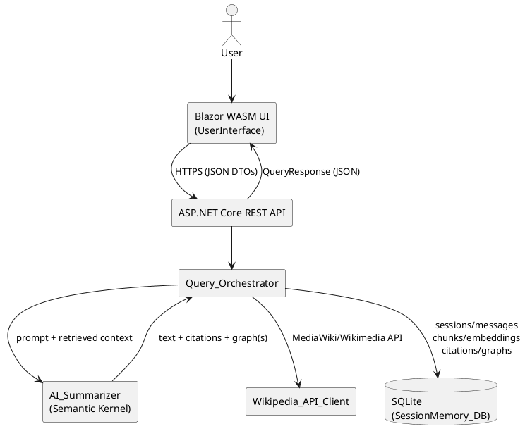
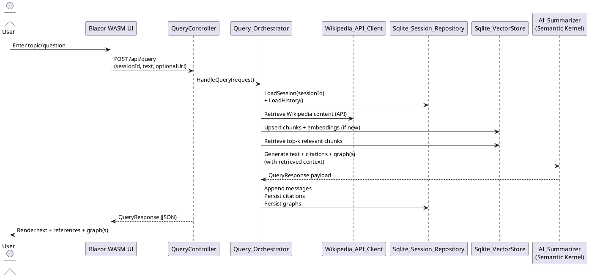
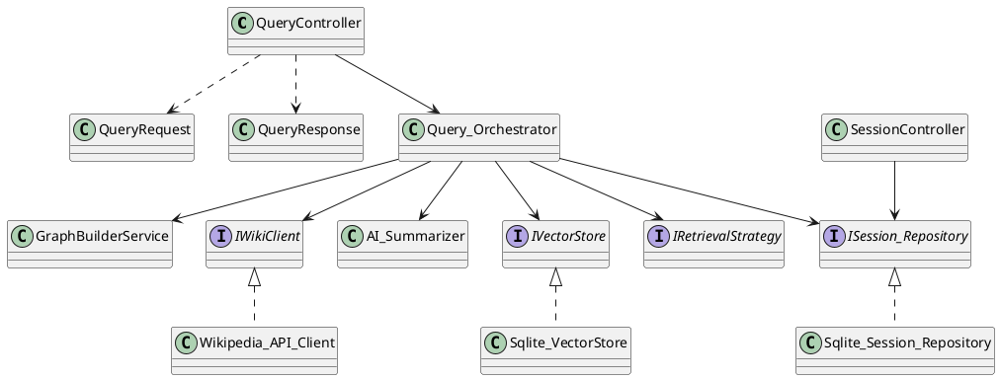
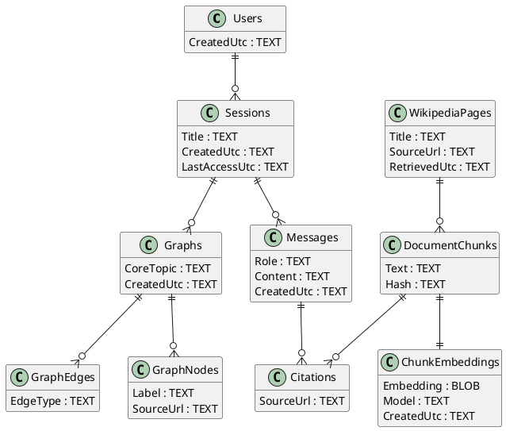

# Implementation Outline — Wikipedia RAG Chat, Study Guide, and Topic Graphs

For build, run, API, UI hosting, and test instructions, see [USAGE.md](./USAGE.md).

## 1) Goal and scope

This project reduces time spent researching by accepting a Wikipedia topic or article link and using an LLM to summarize and organize Wikipedia-based information into outputs that support early-stage project and paper development. The system prioritizes fast scope expansion and reference gathering rather than replacing deeper investigation. :contentReference[oaicite:0]{index=0}

## 2) System architecture overview

The system is implemented as a web application with a strict separation between the browser UI and server-side services. The client is a Blazor WebAssembly `UserInterface` composed of Razor components that render content and capture input, while all retrieval, summarization, graph building, and persistence run behind an ASP.NET Core REST API. The UI communicates with the API over HTTPS using JSON request/response DTOs so the client only depends on stable contracts rather than internal entities. Wikipedia data is obtained through the official MediaWiki/Wikimedia API using `System.Net.Http` and a dedicated client such as `Wikipedia_API_Client`. Natural-language reasoning is orchestrated via Microsoft Semantic Kernel with a retrieval-augmented generation (RAG) workflow, coordinated by services such as `AI_Summarizer` and `Query_Orchestrator`. Session memory and retrieval artifacts are stored in SQLite through an ORM/repository boundary such as `SessionMemory_DB` and `Sqlite_Session_Repository`. :contentReference[oaicite:1]{index=1}

## 3) User interface (Blazor WASM)

The Blazor WebAssembly UI is a chat application with the following layout and behavior:

- **Sidebar (prior chats / sessions):**  
  A left sidebar lists prior chats (sessions) and allows users to select a session to reload its history, citations, and graphs. This view is backed by server-side session records so prior chats can be retrieved consistently across browser refreshes.

- **Chat interface (conversation + input):**  
  The main panel displays the conversation history and supports user input as either a topic prompt (keywords) or a Wikipedia URL. Messages are persisted server-side so the UI remains stateless beyond the session identifier.

- **Outputs (text + references + graphs):**  
  Each assistant response contains:
  1. **Textual response (study-guide style):** a concise explanation organized for note-taking.
  2. **Wikipedia references:** citations returned as part of the response payload so users can verify sources and navigate directly to relevant pages/sections.
  3. **Topic graph visualization:** a graph of Wikipedia articles with the user’s topic prompt at the center.  
     Multiple graphs may appear within a single session when the system extracts multiple core topics from the user’s prompt(s) or the retrieved Wikipedia content. Graphs are persisted so they can be reloaded when a prior chat is selected.

UI components are expected to include `ChatSidebar`, `ChatThread`, `MessageView`, `CitationList`, and `GraphView`, coordinated by a thin API client service (e.g., `ApiClient`) that calls the REST API and maps responses to view models.

## 4) REST API surface (ASP.NET Core)

The REST API exposes endpoints that support session management, query submission, and retrieval of prior results. The exact routing can vary, but the contract typically includes:

- `POST /api/sessions` → create a new session (returns `sessionId`)
- `GET /api/sessions` → list sessions for the current user/device
- `GET /api/sessions/{sessionId}` → retrieve session metadata and message history
- `POST /api/query` → submit a prompt or Wikipedia URL (returns response text, citations, and graph payloads)
- `GET /api/sessions/{sessionId}/graphs` → retrieve previously generated graphs (optional but recommended for fast UI loads)

Controllers follow the proposal’s style (e.g., `QueryController`, `SessionController`) and return DTOs (e.g., `QueryRequest`, `QueryResponse`) to prevent leaking internal database entities to the UI. :contentReference[oaicite:2]{index=2}

## 5) RAG workflow and Semantic Kernel integration

The RAG workflow is coordinated by `Query_Orchestrator` and executed through Semantic Kernel via a service such as `AI_Summarizer`. For each user query:

1. **Load session state:** retrieve the session and message history from SQLite.
2. **Resolve and retrieve Wikipedia content:** call the MediaWiki/Wikimedia API through `Wikipedia_API_Client` to obtain page content and metadata needed for citations.
3. **Normalize and chunk:** segment Wikipedia content into chunks suitable for retrieval; store stable identifiers and source references.
4. **Upsert retrieval memory:** generate embeddings for new chunks and store them in the SQLite-backed vector store.
5. **Retrieve relevant context:** perform semantic similarity search to select top-k chunks for the query.
6. **Generate grounded outputs:** invoke Semantic Kernel with the retrieved context to produce:
   - study-guide text,
   - citations (Wikipedia URLs and chunk identifiers), and
   - one or more topic graphs (nodes/edges) centered on the user’s topic prompt and derived core topics.
7. **Persist outputs:** append new messages, citations, and graph artifacts to SQLite.
8. **Return JSON payload:** send `QueryResponse` to the UI containing text + citations + graph data.

This keeps Wikipedia retrieval, memory search, and response generation modular (plugin/function style), while the orchestrator enforces ordering, persistence, and response shaping. :contentReference[oaicite:3]{index=3}

## 6) Data storage and retrieval (SQLite)

All user data is stored in SQLite for reliable retrieval. The SQLite database is the system-of-record for:

- **Sessions / chats:** session identifiers, titles/topics, created/last-access timestamps
- **Messages:** role (user/assistant), content, timestamps, ordering
- **Wikipedia artifacts:** page identifiers, source URLs, chunk metadata, hashes for deduplication
- **Vector memory:** embeddings and embedding model metadata (stored as BLOB/JSON)
- **Citations:** links between assistant responses and the Wikipedia sources/chunks used
- **Graphs:** graph definitions keyed by session and core topic; node and edge records

Persistence is accessed through a boundary such as `SessionMemory_DB` and implemented via repository classes such as `Sqlite_Session_Repository` (and `Sqlite_VectorStore` for embeddings). This ensures that selecting a prior chat in the UI can reload the full conversation, citations, and graphs without recomputation. :contentReference[oaicite:4]{index=4}

## 7) Expected implementation classes (aligned to proposal naming)

### UI (Blazor WASM)
- `UserInterface` (root layout / routing)
- `ChatSidebar`, `ChatThread`, `MessageView`
- `CitationList`, `GraphView`
- `ApiClient` (typed HTTP wrapper for REST endpoints)

### API layer
- `QueryController`, `SessionController`
- DTOs: `QueryRequest`, `QueryResponse`, `SessionResponse`, `GraphResponse`

### Application services
- `Query_Orchestrator` (workflow coordinator)
- `AI_Summarizer` (Semantic Kernel invocation + output shaping)
- `WikipediaIngestionService` (normalize + chunk + citation mapping)
- `RagRetrievalService` (top-k retrieval)
- `GraphBuilderService` (construct graphs from extracted core topics and Wikipedia relationships)

### Infrastructure and persistence
- `Wikipedia_API_Client` (MediaWiki/Wikimedia API client)
- `SessionMemory_DB` (persistence boundary)
- `Sqlite_Session_Repository` (sessions/messages/citations/graphs)
- `Sqlite_VectorStore` (chunks/embeddings/similarity retrieval)

Polymorphism is primarily supported through interfaces such as `IWikiClient`, `ISession_Repository`, `IVectorStore`, and `IRetrievalStrategy`, while inheritance is used where it matches the framework (e.g., controllers deriving from `ControllerBase`). :contentReference[oaicite:5]{index=5}

---

# Automatic UML diagram generation (TreeUML / PlantUML workflow)

The following UML blocks are written in a PlantUML-compatible “TreeUML” style so diagrams can be generated automatically from this Markdown:

- **Editor-based generation:** use a PlantUML/TreeUML extension in your editor (commonly available in VS Code and JetBrains IDEs) to render diagrams directly from fenced `plantuml` blocks.
- **Markdown preview rendering:** use a Markdown preview extension that recognizes PlantUML blocks and renders them inline.
- **CI-based rendering:** configure a documentation pipeline (or a build step) that converts PlantUML blocks into SVG/PNG artifacts and links them into rendered documentation.

Recommended convention: keep diagrams in this single Markdown file and ensure each diagram block starts with `@startuml` and ends with `@enduml`.

---

# TreeUML (PlantUML) diagrams

## A) Component diagram

# Sequence Diagram

# High-Level Class Diagram

#   Logical Database Diagram

